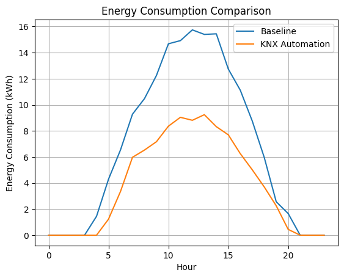
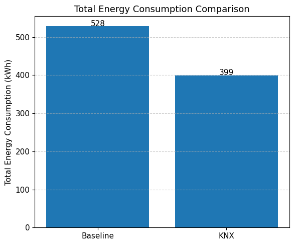
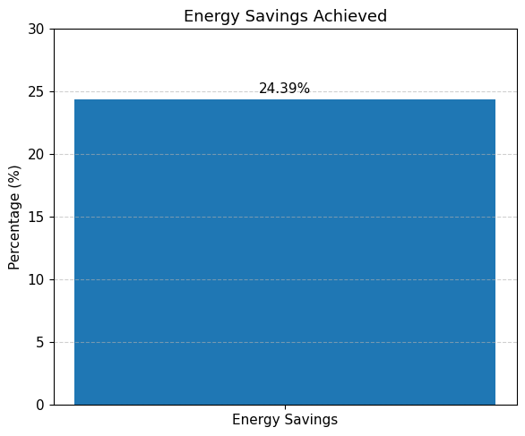

# Smart Building Energy Optimization using KNX Automation

## Overview
This project simulates a smart building energy management system using KNX automation to optimize energy consumption.

## Key Results
- ~25% reduction in energy consumption
- Occupancy-based intelligent control
- Scalable automation strategy

## Project Preview

### Energy Consumption Profile

### Total Energy Comparison

### Energy Savings

## Engineering Value
- System modeling for energy optimization
- Control-oriented simulation
- Application of smart building technologies

## Technologies
- Python
- NumPy
- Matplotlib

## How to Run
pip install -r requirements.txt  
python main.py

## Future Work
- Integration with real KNX hardware
- Real-time implementation using IoT
- Integration with KNX protocol devices
- Advanced control (PID / AI-based optimization)
- Embedded systems implementation (C/C++)
- AI-based energy prediction
